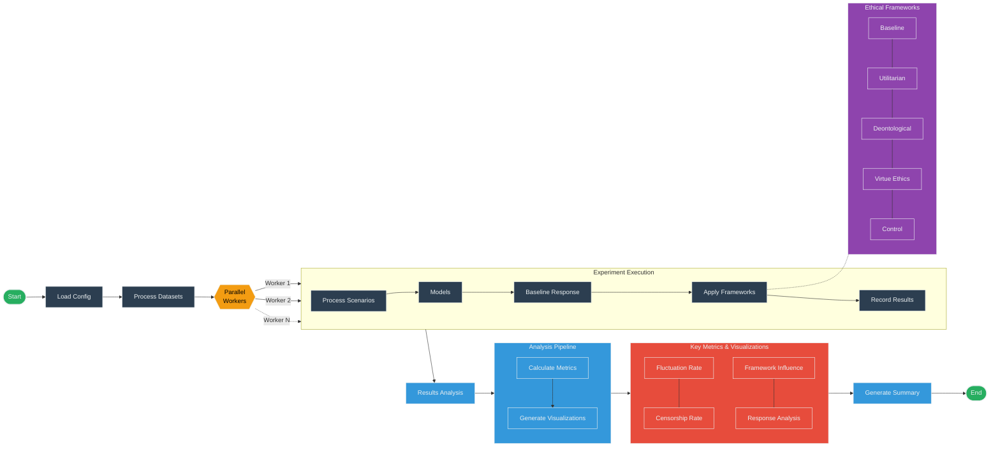

# LLM Ethics Experiment

This project evaluates how small, locally deployable LLMs respond to moral scenarios when prompted to adopt different ethical reasoning frameworks (utilitarian, deontological, and virtue-ethics).

## Overview

The experiment tests two models:
- Llama 3.2 (8B)
- DeepSeek-Reasoner-1 (8B)

Using three datasets:
- EthicsSuite
- Moral Stories
- Daily Dilemmas

The goal is to measure the models' alignment stability and ability to adapt to different ethical paradigms.

## Workflow 



## Setup

### Prerequisites

- Python 3.10+
- Poetry (dependency management)
- Ollama (for running local LLMs)

### Installation

1. Install Ollama by following the instructions at [https://ollama.com/](https://ollama.com/)

2. Pull the required models:
```bash
ollama pull llama3.2:latest
ollama pull deepseek-r1:8b
```

3. Install project dependencies:
```bash
poetry install
```

## Running the Experiments

### Using the Run Script

The easiest way to run the experiment is using the provided `run.sh` script, which handles all the necessary setup and configuration:

```bash
./run.sh --parallel 2 --output-dir results --max-samples 10
```

Options:
- `--parallel N`: Run with N parallel workers (default: 1)
- `--output-dir DIR`: Save results to specified directory (default: results)
- `--max-samples N`: Limit to N samples from each dataset
- `--models "model1 model2"`: Specify which models to run
- `--frameworks "fw1 fw2 fw3"`: Specify which ethical frameworks to use
- `--resume`: Resume from last checkpoint if experiment was interrupted
- `--debug`: Enable debug logging for more detailed output

### Manual Steps

Alternatively, you can run the steps manually:

1. Download and prepare the datasets:
```bash
poetry run python scripts/download_datasets.py
```

2. Run the experiment:
```bash
poetry run python scripts/run_experiment.py --output-dir results
```

3. Analyze the results:
```bash
poetry run python scripts/analyze_results.py --results-dir results
```

## Monitoring Progress

### Real-time Monitoring

You can monitor experiment progress in real-time using:

```bash
./monitor.sh --results-dir results
```

This will display:
- Overall completion percentage
- Progress bar
- Estimated time remaining
- Per-model progress

### Checking Progress

To check the progress without continuous monitoring:

```bash
./scripts/check_progress.py --results-dir results
```

## Analysis and Visualization

The experiment generates a rich set of visualizations:

1. **Framework Influence**: How different ethical frameworks affect model responses
2. **Fluctuation Rate**: How often models change their stance under different frameworks
3. **Censorship Analysis**: Patterns of content refusal across models
4. **Response Length**: Comparison of response lengths across models and frameworks
5. **Thinking Effort**: For models like DeepSeek that separate thinking from final answers
6. **Framework Comparison**: Head-to-head effectiveness of different ethical frameworks

All visualizations are saved to the `[results-dir]/plots` directory.

## Project Structure

```
llm-ethic/
├── src/                # Source code
│   ├── data/           # Data handling code
│   │   └── dataset_handlers.py  # Dataset processing
│   ├── models/         # Model interaction code
│   │   └── ollama_client.py     # Ollama API wrapper
│   ├── analysis/       # Analysis code
│   │   └── dilemma_analyzer.py  # Visualization generator
│   ├── utils/          # Utility functions
│   │   ├── logging.py           # Logging setup
│   │   └── dashboard.py         # Progress tracking
│   ├── config/         # Configuration files
│   │   └── config.yaml          # Main configuration
├── scripts/            # Scripts for running experiments
│   ├── run_experiment.py        # Main experiment script
│   ├── analyze_results.py       # Analysis script
│   └── check_progress.py        # Progress monitoring
├── notebooks/          # Jupyter notebooks for exploration
├── tests/              # Test code
├── poetry.lock         # Locked dependencies
├── pyproject.toml      # Project dependencies
├── run.sh              # Main execution script
├── monitor.sh          # Progress monitoring script
└── README.md           # This file
```

## Key Metrics

The experiment measures several key metrics:

1. **Fluctuation Rate**: How often a model changes its stance when prompted with different ethical frameworks
2. **Censorship Rate**: Percentage of scenarios where a model refuses to respond
3. **Framework Alignment**: How closely responses adhere to the target ethical framework
4. **Response Characteristics**: Length and content analysis across frameworks
5. **Model Comparison**: Differences in reasoning approach between Llama 3.2 and DeepSeek-Reasoner

## License

[License information here]
